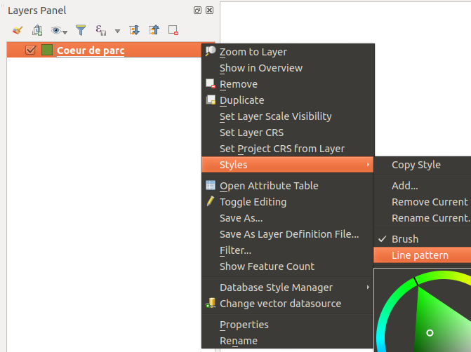
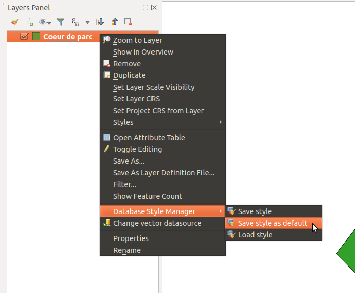

# Database style manager
This plugin allows you to synchronize styles contained in PostgreSQL with QGIS Desktop.

Only for QGIS 2. QGIS 2.18.20 is needed to save style in the DB.

## By default, with QGIS Desktop, without the plugin

* You can store one or many styles for one layer in postgresql.
* You can store one style as default for a layer.
* QGIS will automatically load the default style associated when the layer is added to the mapcanvas.
* To load all styles associated to a layer, you need to do it manually:
  * In the contextual menu of the layer, add a new style.
  * In layer properties, load new style from database.
  * Rename the style in QGIS to match the name in the database.
  * Do these steps for all styles.

Loading a postgresql layer in QGIS:
* No style loaded in the layer menu
* No layer name in the legend. It's still the table name `c_coeur_de_parc`.

## With the plugin
* QGIS will load automatically all styles associated with the layer.
* This behavior can be enabled/disabled with the button in the toolbar.
* The name of the style will be loaded too in the menu.
* The name will match in QGIS Desktop and Postgis.
* QGIS will save the layer name as description in the style table.
* The name of the style description will be loaded as layer name in the legend.

Loading a postgresql layer in QGIS:
* All styles are loaded with their names
* Layer name is set: `Coeur de parc`

* Menu to load all styles from postgis

## Todo
* Improve layer name (maybe QGIS 2.18.21 and QGIS 3.2.0)
* Delete styles for QGIS < 3.0